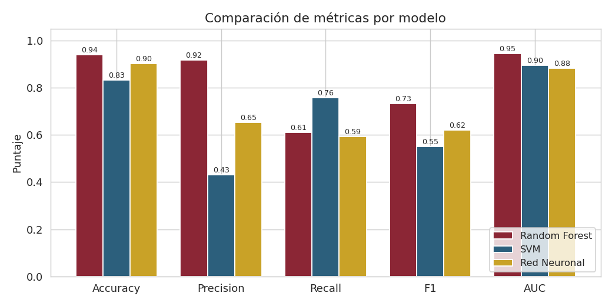
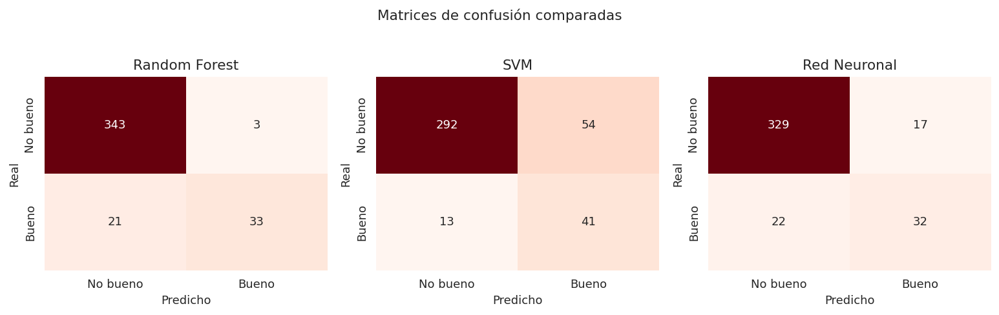
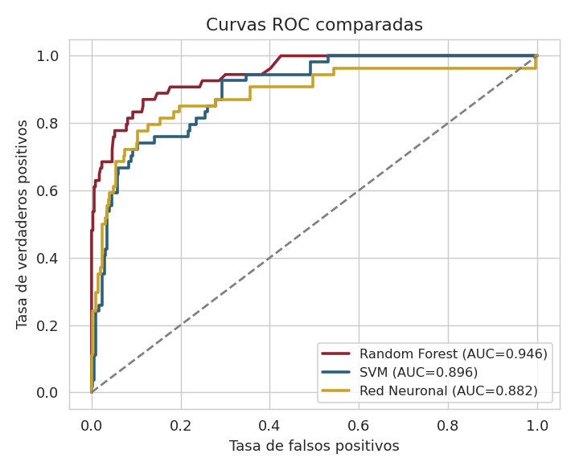

# Comparación de Modelos de Clasificación
## Evidencia Final — Segundo Modelo de Aprendizaje Automático

**SVM y Red Neuronal frente a Random Forest · Dataset Red Wine Quality (Kaggle)**

| | |
|---|---|
| **Título** | Evidencia Final de Aprendizaje Automático Supervisado |
| **Nombre** | ______________________________ |
| **Fecha** | ______________________________ |
| **Curso** | ______________________________ |

---

## 1. Resumen del caso y modelo anterior (Evidencia 1)

En la evidencia previa se abordó un problema de **clasificación binaria**: predecir si un vino tinto es de alta calidad (*quality* ≥ 7) a partir de sus 11 variables fisicoquímicas, usando el dataset **Red Wine Quality** (1.599 muestras del vino portugués "Vinho Verde"). Se compararon Regresión Logística, KNN y Random Forest, seleccionando **Random Forest** como mejor modelo con **Accuracy 0.94, F1 0.73 y AUC 0.95**.

Esta evidencia final da continuidad al caso: se aplican **dos modelos nuevos** —**Máquinas de Soporte Vectorial (SVM)** y una **Red Neuronal básica (MLP, una capa oculta)**— sobre el mismo problema y partición de datos, y se comparan con Random Forest para recomendar cuál implementar en un contexto real.

---

## 2. Descripción del conjunto de datos

Se reutiliza el dataset **Red Wine Quality** (Kaggle/UCI): 1.599 muestras con 11 predictores fisicoquímicos numéricos (alcohol, sulfatos, acidez volátil, densidad, pH, etc.) y la variable objetivo binaria *good* (1 si *quality* ≥ 7). Las clases están **desbalanceadas (~14% positivos)**, por lo que la evaluación se centra en **F1 y AUC** además del accuracy. El preprocesamiento (división estratificada 75/25 y estandarización) es idéntico al de la evidencia 1, garantizando una comparación justa: los tres modelos ven exactamente los mismos datos.

---

## 3. Descripción de los nuevos modelos aplicados

### Máquinas de Soporte Vectorial (SVM)

A diferencia de Random Forest, que es un **ensamble de árboles** con reglas jerárquicas, **SVM busca el hiperplano que separa las dos clases con el máximo margen**. Con un *kernel* RBF modela fronteras no lineales proyectando los datos a un espacio de mayor dimensión. Es apropiado para este problema binario con variables continuas y frontera compleja. Requiere datos **estandarizados** (se basa en distancias) y usa `class_weight="balanced"` para el desbalance.

### Red Neuronal básica (MLP)

Una **red neuronal multicapa con una capa oculta de 32 neuronas** aprende combinaciones no lineales de las variables ajustando pesos por retropropagación. Frente a RF (interpretable) y SVM (geométrico), la red es un **aproximador universal** capaz de capturar interacciones complejas, a costa de menor interpretabilidad y mayor necesidad de datos. Se entrena con datos escalados hasta converger.

---

## 4. Comparación de resultados: métricas

Los tres modelos se evaluaron con las mismas cinco métricas sobre el conjunto de prueba:

| Modelo | Accuracy | Precision | Recall | F1 | AUC |
|---|:---:|:---:|:---:|:---:|:---:|
| **Random Forest (Ev.1)** | **0.940** | **0.917** | **0.611** | **0.733** | **0.946** |
| SVM (RBF) | 0.832 | 0.432 | 0.759 | 0.550 | 0.896 |
| Red Neuronal (MLP) | 0.902 | 0.653 | 0.593 | 0.621 | 0.882 |

   
  <em>Figura 1. Comparación de las cinco métricas para los tres modelos.</em>

**Interpretación.** **Random Forest lidera** en precisión (0.92), F1 (0.733) y AUC (0.946). **SVM** obtiene el **recall más alto (0.76)** —detecta más vinos buenos— pero con precisión baja (0.43), es decir, muchos falsos positivos. La **Red Neuronal** queda en un punto intermedio (F1 0.621, AUC 0.882), con mejor precisión que SVM pero sin superar al ensamble.

---

## 5. Comparación de resultados: visualizaciones

### Matrices de confusión

   
  <em>Figura 2. Matrices de confusión comparadas (prueba: 400 vinos).</em>

**Interpretación.** Random Forest comete solo **3 falsos positivos** pero deja pasar 21 vinos buenos. SVM captura más buenos (41 de 54) a cambio de **54 falsos positivos**. La red neuronal se sitúa en medio (12 falsos positivos, 31 buenos detectados). El perfil de error de cada modelo define su utilidad según el costo de negocio.

### Curvas ROC

   
  <em>Figura 3. Curvas ROC superpuestas. Random Forest domina en casi todo el rango.</em>

**Interpretación.** La curva de Random Forest se mantiene por encima en la mayor parte del rango (AUC 0.946), confirmando el mejor poder discriminante global; SVM (0.896) y la red (0.882) quedan por debajo aunque siguen siendo modelos competentes.

---

## 6. Conclusión ejecutiva y recomendación

Con base en dos evidencias técnicas —la **tabla de métricas** (Random Forest lidera en F1 y AUC) y las **matrices de confusión** (Random Forest minimiza los falsos positivos)—, se recomienda **implementar Random Forest** en el contexto real de la bodega. Es el modelo con mejor equilibrio precisión-desempeño, aporta **interpretabilidad** mediante la importancia de variables (alcohol, sulfatos y acidez volátil) y es robusto sin requerir escalado de datos.

> **Recomendación final:** Random Forest para el objetivo de priorizar lotes premium con pocos falsos positivos. Si el negocio priorizara **no dejar escapar ningún vino bueno** (cobertura sobre precisión), SVM sería preferible por su recall superior (0.76). La red neuronal se justificaría solo ante un volumen de datos considerablemente mayor.

**Impacto en un contexto real:** automatizar la clasificación permite a la bodega filtrar lotes prometedores sin depender de catas humanas costosas, reduciendo tiempos y costos de control de calidad, y orientando decisiones de producción hacia las variables más determinantes de la calidad.

---

## Referencias

Cortez, P., Cerdeira, A., Almeida, F., Matos, T., & Reis, J. (2009). Modeling wine preferences by data mining from physicochemical properties. *Decision Support Systems, 47*(4), 547–553. https://doi.org/10.1016/j.dss.2009.05.016

Dua, D., & Graff, C. (2019). *UCI Machine Learning Repository: Wine Quality Data Set.* University of California, Irvine, School of Information and Computer Sciences. https://archive.ics.uci.edu/ml/datasets/wine+quality
